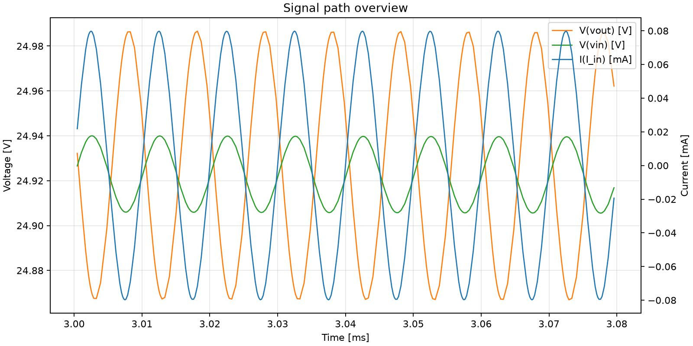
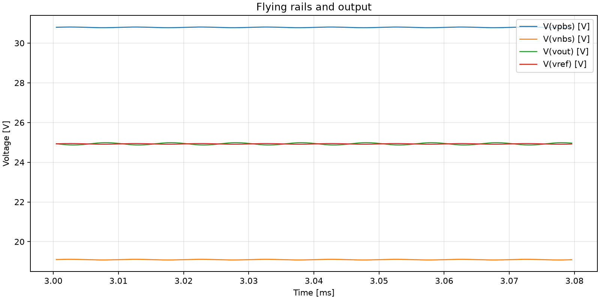
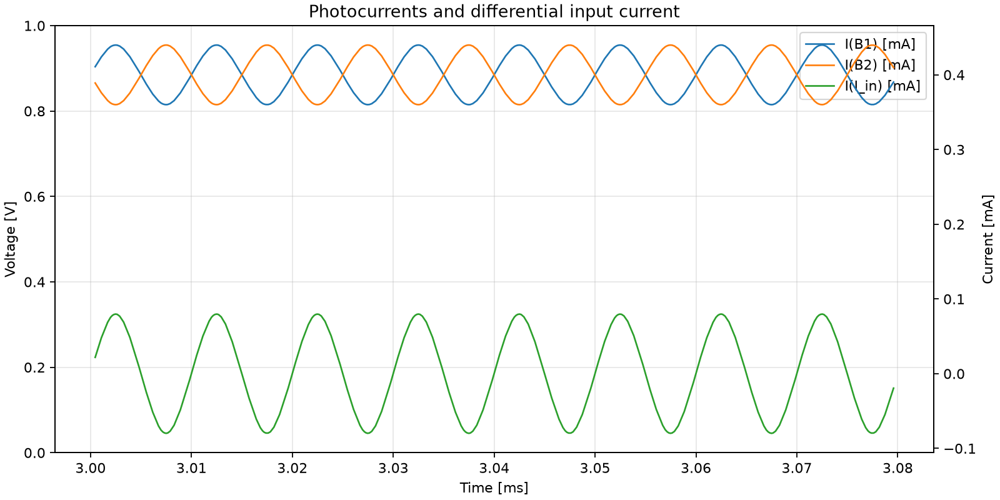

# E01_baseline_differential_no_test_current

Source case: [Rail_to_rail_Oscillation_on input](../../Simulations/Rail_to_rail_Oscillation_on%20input)

## Question

Does the differential optical input produce I_in = I1 - I2 and the expected TIA output gain?

## Circuit Change

I1 test current set to 0; B1 and B2 use equal responsivity for the no-DC-offset baseline.

## Simulation Health

- Warnings: 5
- Errors: 0
- Warning detail: `Warning: Multiple definitions of model "2scr375p" Type: BJT`
- Warning detail: `Warning: Multiple definitions of model "bc857b" Type: BJT`
- Warning detail: `Warning: Multiple definitions of model "bc847c" Type: BJT`
- Warning detail: `Warning: Multiple definitions of model "bc847b" Type: BJT`
- Warning detail: `WARNING: Less than two connections to node u1:9.  This node is used by e:u1:cmr.`

## Metrics

Metrics measured after `0.003 s`.

| Signal | Mean | Min | Max | Peak-to-peak | AC RMS |
| --- | ---: | ---: | ---: | ---: | ---: |
| `I(I_in)` | -9.78012e-08 | -7.98086e-05 | 7.98091e-05 | 0.000159618 | 6.55486e-05 |
| `V(vout)` | 24.9053 | 24.8241 | 24.9866 | 0.162514 | 0.0484278 |
| `V(vin)` | 24.9012 | 24.8626 | 24.94 | 0.0774288 | 0.0188176 |
| `V(vpbs)` | 30.7703 | 30.7317 | 30.809 | 0.0772991 | 0.0186967 |
| `V(vnbs)` | 19.0734 | 19.0348 | 19.112 | 0.0772133 | 0.0186797 |
| `I(B1)` | 0.000399951 | 0.000360096 | 0.000439905 | 7.98088e-05 | 3.27743e-05 |
| `I(B2)` | 0.000400049 | 0.000360095 | 0.000439904 | 7.98088e-05 | 3.27743e-05 |

## Derived Results

- Transimpedance estimate `V(vout)_pp / I(I_in)_pp`: `1018.14 Ohm`
- Phase estimate of `V(vout)` relative to `I(I_in)` at `100000 Hz`: `-169.519 deg`

## Plots

## Observation

TBD

## Decision

TBD
