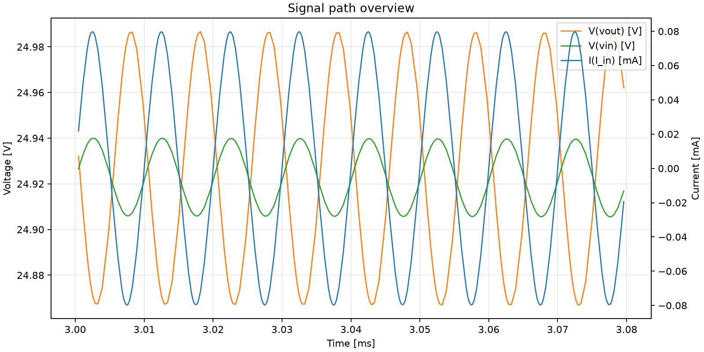
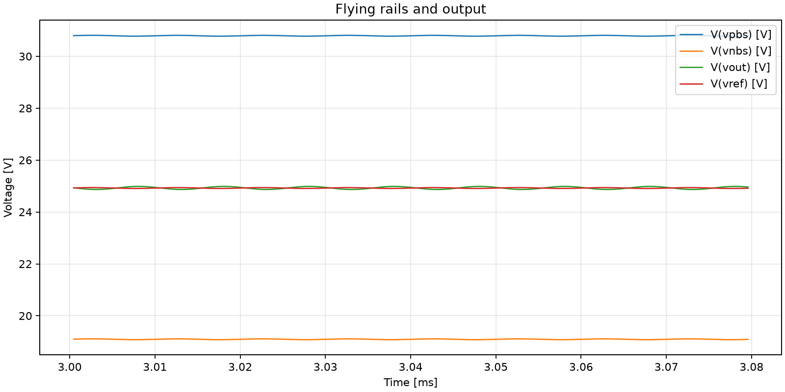
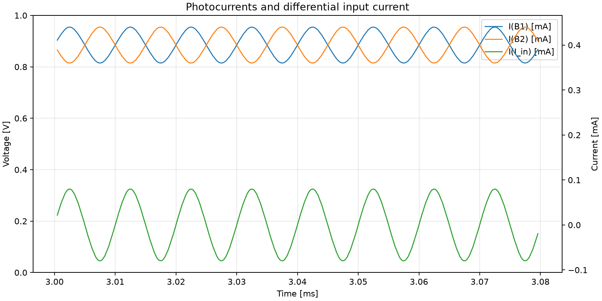

# E02_apd_capacitance_2p_manual

Source case: [APD_Capacitance_manual_test](../../Simulations/APD_Capacitance_manual_test)

## Question

Does adding 2 pF APD junction capacitance in parallel with each APD current source change the 100 kHz differential transimpedance response?

## Circuit Change

Added C_APD1 = 2 pF from VP to VIN and C_APD2 = 2 pF from VIN to ground, in parallel with the two APD photocurrent sources.

## Simulation Health

- Warnings: 5
- Errors: 0
- Warning detail: `Warning: Multiple definitions of model "2scr375p" Type: BJT`
- Warning detail: `Warning: Multiple definitions of model "bc857b" Type: BJT`
- Warning detail: `Warning: Multiple definitions of model "bc847c" Type: BJT`
- Warning detail: `Warning: Multiple definitions of model "bc847b" Type: BJT`
- Warning detail: `WARNING: Less than two connections to node u1:9.  This node is used by e:u1:cmr.`

## Metrics

Metrics measured after `0.003 s`.

| Signal | Mean | Min | Max | Peak-to-peak | AC RMS |
| --- | ---: | ---: | ---: | ---: | ---: |
| `I(I_in)` | -8.51071e-08 | -7.98054e-05 | 7.98058e-05 | 0.000159611 | 6.55397e-05 |
| `V(vout)` | 24.9053 | 24.8241 | 24.9866 | 0.162506 | 0.0484212 |
| `V(vin)` | 24.9012 | 24.8626 | 24.94 | 0.0774212 | 0.0188141 |
| `V(vpbs)` | 30.7703 | 30.7317 | 30.809 | 0.0772934 | 0.0186931 |
| `V(vnbs)` | 19.0734 | 19.0348 | 19.112 | 0.0772076 | 0.0186761 |
| `I(B1)` | 0.000399957 | 0.000360096 | 0.000439905 | 7.9809e-05 | 3.27723e-05 |
| `I(B2)` | 0.000400043 | 0.000360095 | 0.000439904 | 7.9809e-05 | 3.27723e-05 |

## Derived Results

- Transimpedance estimate `V(vout)_pp / I(I_in)_pp`: `1018.14 Ohm`
- Phase estimate of `V(vout)` relative to `I(I_in)` at `100000 Hz`: `-169.512 deg`

## Baseline Comparison

Compared against `E01_baseline_differential_no_test_current`.

| Quantity | Baseline E01 | APD capacitance E02 | Difference |
| --- | ---: | ---: | ---: |
| `I(I_in)` peak-to-peak | `0.000159618 A` | `0.000159611 A` | `-7e-09 A` |
| `V(vout)` peak-to-peak | `0.162514 V` | `0.162506 V` | `-8e-06 V` |
| Transimpedance estimate | `1018.14 Ohm` | `1018.14 Ohm` | approximately `0 Ohm` |
| Phase estimate at `100 kHz` | `-169.519 deg` | `-169.512 deg` | `+0.007 deg` |

Initial interpretation: with `2 pF` APD capacitance on both photodiode branches, the 100 kHz differential response is essentially unchanged in this simulation. The capacitance is now included, but at this frequency and operating point it does not yet create a measurable gain drop or relevant phase shift.

## Plots

## Observation

- Visual observation from LTspice:
- Does `I(I_in)` still look centered around zero?
- Does `V(vout)` keep the same amplitude and shape as the baseline?
- Is any new ringing, overshoot, or instability visible?
- Are the bootstrapped nodes `VPBS` and `VNBS` still clean?

## Decision

At `2 pF` and `100 kHz`, APD junction capacitance does not appear to be the limiting factor. A useful next experiment would be to keep the same circuit and sweep capacitance or frequency, but this note should first be completed with the visual observation above.
