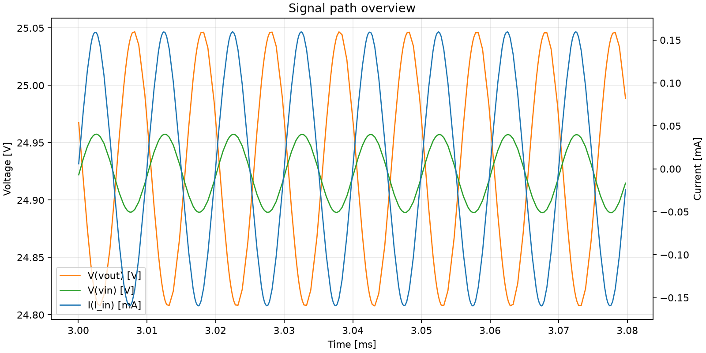
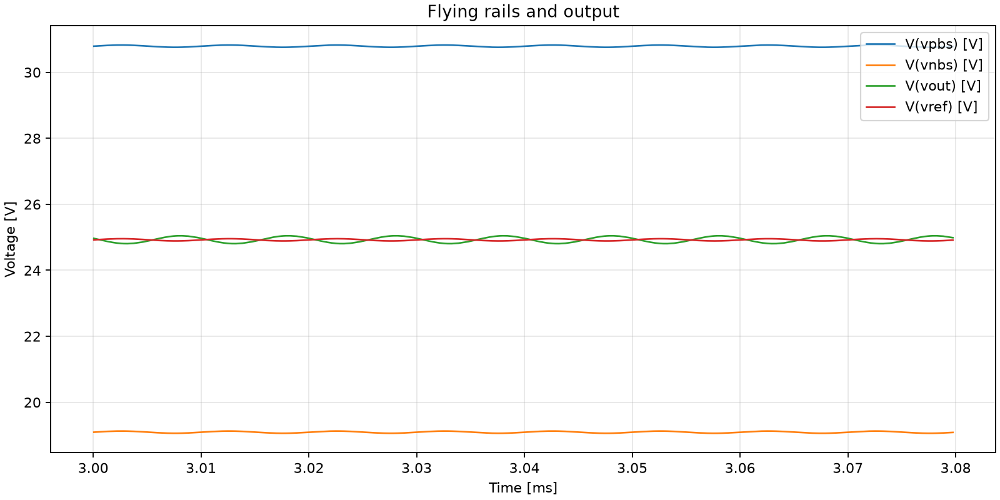
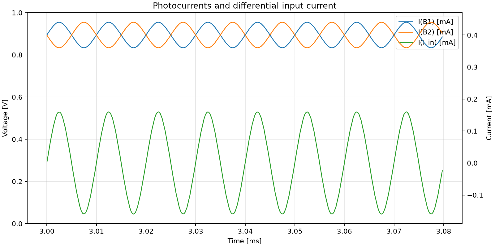

# E03_explicit_I1_I2_plus_B_sources

Source case: [APD_Capacitance_manual_test](../../Simulations/APD_Capacitance_manual_test)

## Question

What happens when explicit I1/I2 current sources are enabled while B1/B2 photocurrent sources are still active?

## Circuit Change

I1 set to SINE(400u 40u 100k), I2 set to SINE(400u -40u 100k), while B1/B2 optical-current behavioral sources remain active.

## Simulation Health

- Warnings: 5
- Errors: 0
- Warning detail: `Warning: Multiple definitions of model "2scr375p" Type: BJT`
- Warning detail: `Warning: Multiple definitions of model "bc857b" Type: BJT`
- Warning detail: `Warning: Multiple definitions of model "bc847c" Type: BJT`
- Warning detail: `Warning: Multiple definitions of model "bc847b" Type: BJT`
- Warning detail: `WARNING: Less than two connections to node u1:9.  This node is used by e:u1:cmr.`

## Metrics

Metrics measured after `0.003 s`.

| Signal | Mean | Min | Max | Peak-to-peak | AC RMS |
| --- | ---: | ---: | ---: | ---: | ---: |
| `I(I_in)` | -9.52654e-08 | -0.000159612 | 0.000159612 | 0.000319223 | 0.000131113 |
| `V(vout)` | 24.9058 | 24.7652 | 25.0467 | 0.281513 | 0.0943727 |
| `V(vin)` | 24.9017 | 24.846 | 24.9575 | 0.111431 | 0.0307239 |
| `V(vpbs)` | 30.7707 | 30.7151 | 30.8262 | 0.111088 | 0.0304125 |
| `V(vnbs)` | 19.074 | 19.0185 | 19.1295 | 0.111019 | 0.030405 |
| `I(B1)` | 0.000399976 | 0.000360095 | 0.000439905 | 7.98091e-05 | 3.27808e-05 |
| `I(B2)` | 0.000400024 | 0.000360095 | 0.000439905 | 7.98091e-05 | 3.27808e-05 |

## Derived Results

- Transimpedance estimate `V(vout)_pp / I(I_in)_pp`: `881.87 Ohm`
- Phase estimate of `V(vout)` relative to `I(I_in)` at `100000 Hz`: `-169.520 deg`

## Plots

## Observation

TBD

## Decision

TBD
