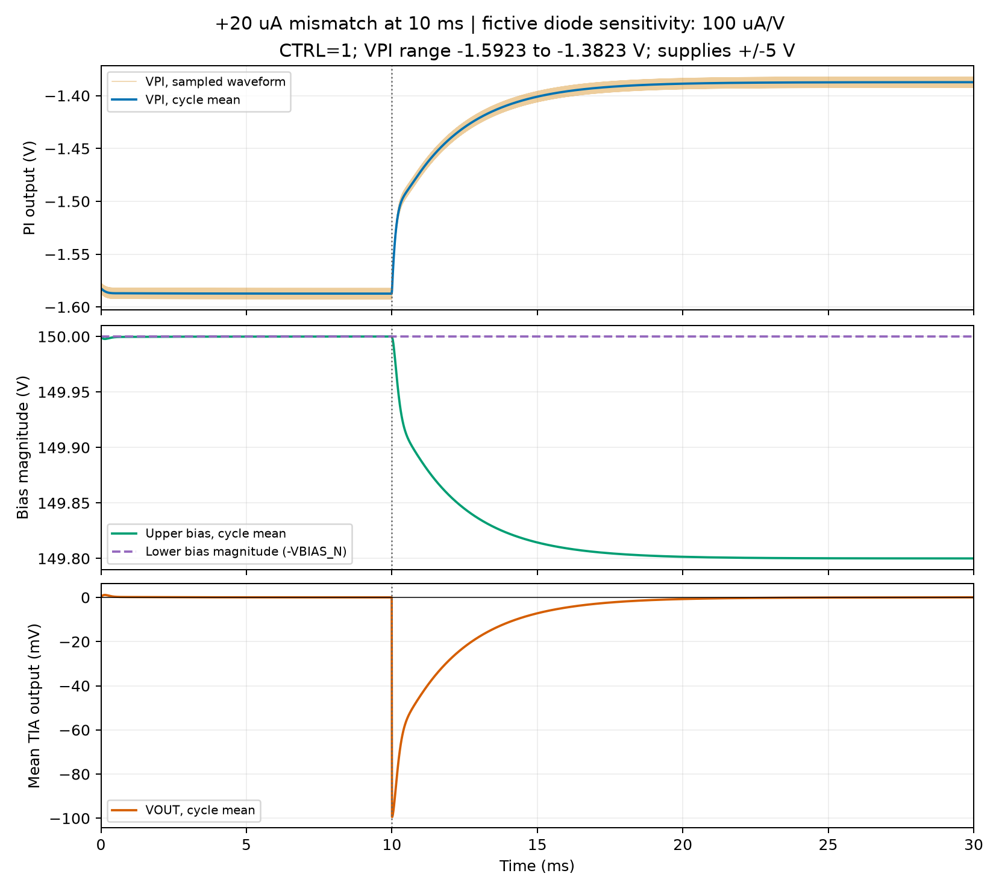

# Balanced TIA And Fictive Bias Control

Edit [tia_check.asc](tia_check.asc) directly in LTspice.

Current switch model (2026-10-08): U3A/U3B now use `TMUX6136_extended.lib`,
an explicitly approximate IBIS + datasheet model. The ADI baseline remains in
`tia_check_ADG1236_alternative.asc`. [Model assumptions and tests](ibis_conversion/extended_model.md).
Results/plot below belong to the previously verified **ADI** run, not the new
TI approximation; the updated detector still needs a native rerun.

Topology follows the two input branches and shared TIA of
`../original_files/bootstrapping.asc`, without its bootstrapping or bias-dependent
behavioral photocurrent expressions.

| Component | Test value |
| --- | --- |
| B1, I2 | 1 mA DC + 50 uA peak, 100 kHz, opposite phase; B1 has fictive bias response |
| D1, D2 | Generic near-ideal diode; no device-specific model |
| CJ1, CJ2 | 2 pF each, arbitrary test values |
| RF, CF | 5 kohm, 2 pF |
| U1 | UniversalOpamp2; Avol=100k, GBW=50 MHz, slew=200 V/us |
| Diode bias | Nominal +150 V / -150 V; upper rail adjusted by PI |
| OPV supplies | +/-5 V |
| Upper bias stage | BSP89, 230 V drain supply, 1 kohm gate resistor, 220 kohm load |

`Dideal` and the B1 bias response are fictive, with no device-specific parameters.
The lower bias remains a fixed ideal source. Only nominal bias magnitudes are
symmetric; the upper rail must change to compensate the imposed mismatch.

## Buffer, LPF And PI

The user's 0 V source `V1` remains between the photodiode midpoint and TIA
input. Positive `I(V1)` flows towards the TIA; feedback stays on the TIA side.

Signal path: `VOUT -> UBUF -> RLP/CLP -> ULP -> RIN/UPI -> VPI`.
`UBUF` and `ULP` are voltage followers. All OPVs use the same generic model
and +/-5 V supplies. U3A selects PI or ground, then RCMD=1 kohm / CCMD=100 nF
filter the command. `VPI` controls the MOSFET gate through the ideal source
`BGATE`: $V_{gate}=150\,\mathrm{V}-V(\mathrm{VCMD})$.
This level translation is a behavioral interface, not a hardware implementation.

| Stage | Values | Ideal transfer function |
| --- | --- | --- |
| Buffer | Unity-gain follower | $H_{BUF}(s)\approx1$ |
| Active LPF | RLP=15.9 kohm, CLP=10 nF; RC followed by ULP | $H_{LP}(s)=1/(0.000159s+1)$ |
| Inverting PI | RIN=RP=100 kohm, CI=7.97 nF; series RP/CI feedback | $H_{PI}(s)=-(s+1254.705144)/s$ |

LPF pole: 1000.974 Hz. PI zero: 199.693 Hz, not a low-pass cutoff.
The DC operating point initializes the PI capacitor. Forced `.ic` values were
removed because they produced an artificial startup rail excursion.

## Mismatch Test

$$
I_{B1}=1\,\mathrm{mA}+50\,\mu\mathrm{A}\sin(2\pi\,100\,\mathrm{kHz}\,t)
+20\,\mu\mathrm{A}\,u(t-10\,\mathrm{ms})
+100\,\mu\mathrm{A/V}\,[V(\mathrm{BIAS\_P},\mathrm{SUM})-150\,\mathrm{V}].
$$

The active `.step` compares CTRL=0/1. U3A/U3B are two channel symbols for one
TMUX6136PWR, with a locally generated approximation in `TMUX6136_extended.lib`.
Switch supply: +/-15 V; logic: 0/3.3 V; temperature set to 25 C.
CTRL=0 selects Vref0=ground and connects PI output to its summing input through
U3B. CTRL=1 selects PI and disconnects the reset contact. U3B.SB is intentionally
unused. [Comparison and pin mapping](../../requirements/control_switch_alternative.md).

Previous ADG1236 baseline verification, 2026-10-08, 100 kHz input, CTRL=1:

| Measurement | Result | Window |
| --- | ---: | --- |
| VPI min / max | -1.59234 / -1.38232 V | Entire 30 ms run |
| VPI before / after | -1.58735 / -1.38734 V | 8--10 / 25--30 ms |
| Upper bias before / after | +150 / +149.8 V | 8--10 / 25--30 ms |
| Lower bias | -150 V | Fixed |
| VOUT DC after | -15.98 uV | 25--30 ms |
| I(V1) DC after | 3.20 nA | 25--30 ms |
| VOUT pp after | 0.997618 V | 25--30 ms |

CTRL=0: final VPI=-0.939 mV, VCMD approximately 0 V. The reset prevents saturation;
the fixed 150 V gate gives about 148.417 V source bias because of V_GS.

No PI rail saturation in either static mode. Settled VPI is nonzero because it must
hold the corrected bias; a nonzero controller output alone is not windup.
LTspice converged using source stepping. Duration: 30 ms; maximum step: 100 ns.
This validates one fictive small-signal mismatch response, not real APD behavior,
startup sequencing, mode switching, protection or stability margins.

Regenerate after running the ASC: `.venv/bin/python tools/plot_tia_control.py`.
The plot selects CTRL=1 when both static states are present.
The plot uses 10 us cycle averages to separate DC correction from the 100 kHz signal.
